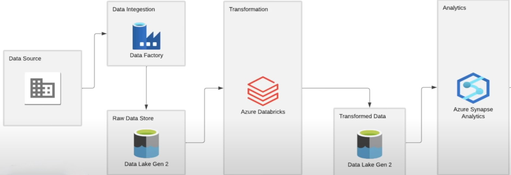

# Azure_Olympic_Analysis
## Overview 
The Tokyo Olympic Data Analysis on Azure project is a comprehensive solution for analyzing and visualizing Olympic Games data using various Azure services. This project aims to showcase how to leverage the power of cloud computing and Azure's data services to gain insights from historical Olympic data. By combining Azure Databricks, Azure Data Factory, and other Azure resources, this project provides a scalable and efficient way to process, transform, and analyze large volumes of Olympic data.
## ARCHITECTURE

The architecture of the project consists of the following components:
- Azure Databricks: Used for data processing, transformation, and analysis. It provides a collaborative and interactive environment for running Spark-based jobs.
- Azure Data Factory: Manages and orchestrates the data workflow. It is responsible for data ingestion from various sources, data transformation, and scheduling of jobs.
- Azure Storage: Serves as the data lake for storing raw and processed data. It can also host intermediate results generated during the analysis.
- Azure SQL Database: Stores the cleaned and transformed data, making it accessible for visualization and reporting.
